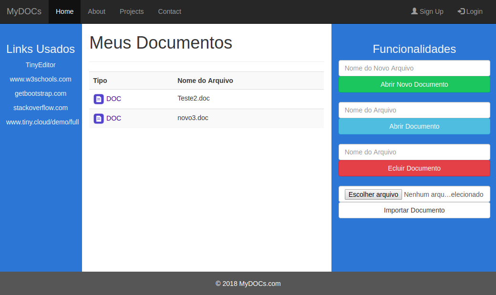
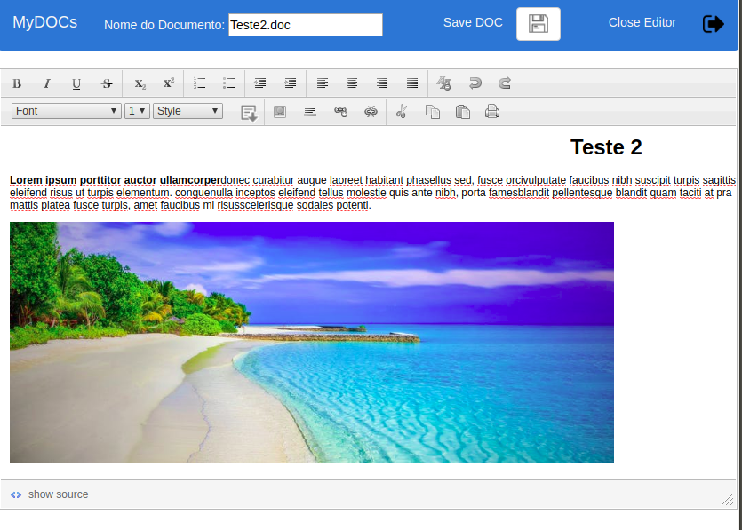

# EditorOnlineDOC

Link do projeto online: [MyDOCs](http://mydocsbsi.000webhostapp.com/)

## Acesso aos Documentos e Funcionalidades

Na primeira tela pode-se verificar as funcionalidades do projeto, onde nesta versão inicial é necessário digitar o nome completo dos arquivos para executar corretamente, incluindo as extensões. 

## Edição dos Documentos

Ao chamar as funcionalidades da primeira tela, a tela de edição abaixo será mostrada, onde pode-se verificar as ferramentas originais do Editor (TinyEditor) e as outras funções adicionadas. 

As ferramentas adicionadas foram: 
* Salvar
* Importar/Upload
* Download 

Obs.:
A implementação do Upload, nesta versão inicial, está limitada pois o sistema operacional (SO) immpede, por segurança, que o endereço absoluto do arquivo selecionnado seja capturado no botão de upload. Então o endereço foi forçado para uma pasta via código. Nos testes locais bastou escolher um pasta e colocar no código. Já para o sistema online, a mesma pasta do teste local foi transferida para o site de hospedagem. E então quando se acessava o arquivo na pasta local, um arquivo com o mesmo nome era importado para o EditorOnline. Para efeito de testes funcionou perfeitamente.

## Links Usados

TinyEditor: https://github.com/jessegreathouse/TinyEditor

W3schools: https://www.w3schools.com/

Getbootstrap.com: https://getbootstrap.com/

Stackoverflow: https://stackoverflow.com/

Tiny: www.tiny.cloud/demo/full

